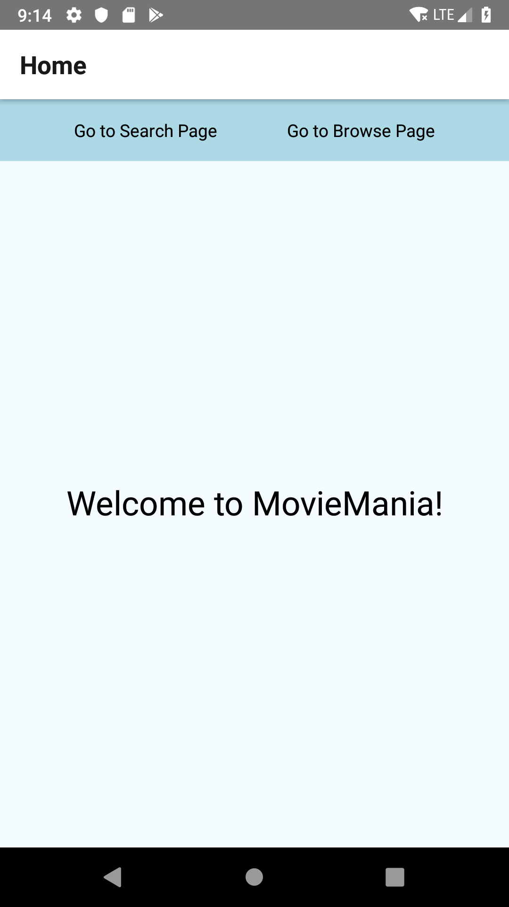
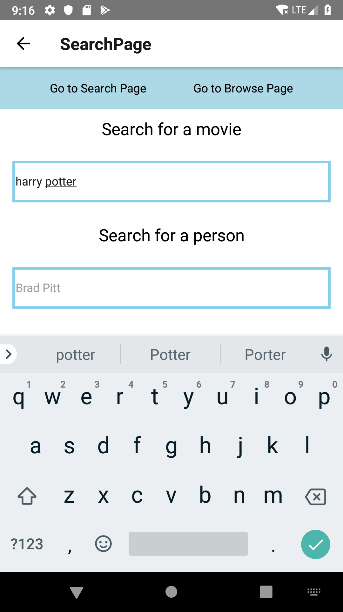
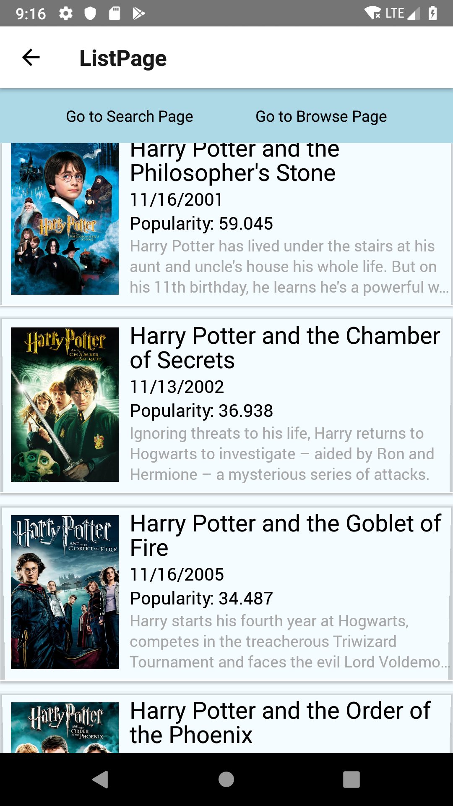
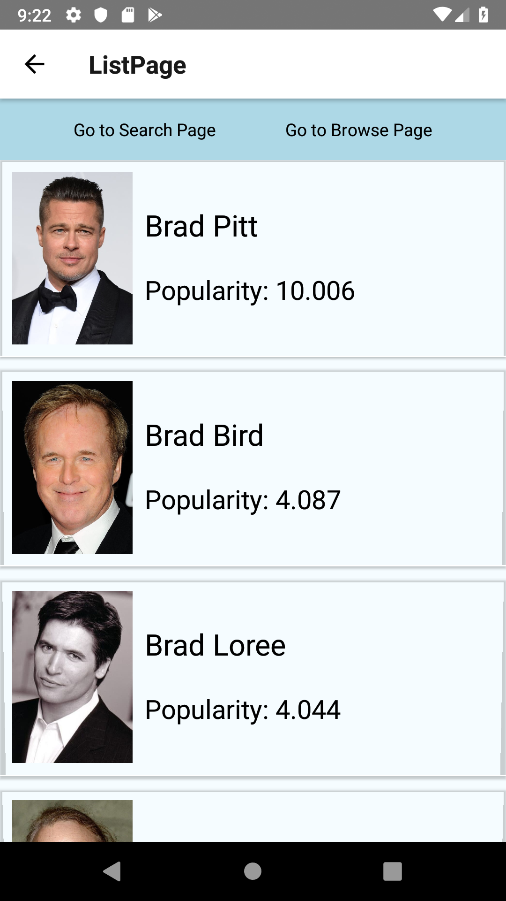
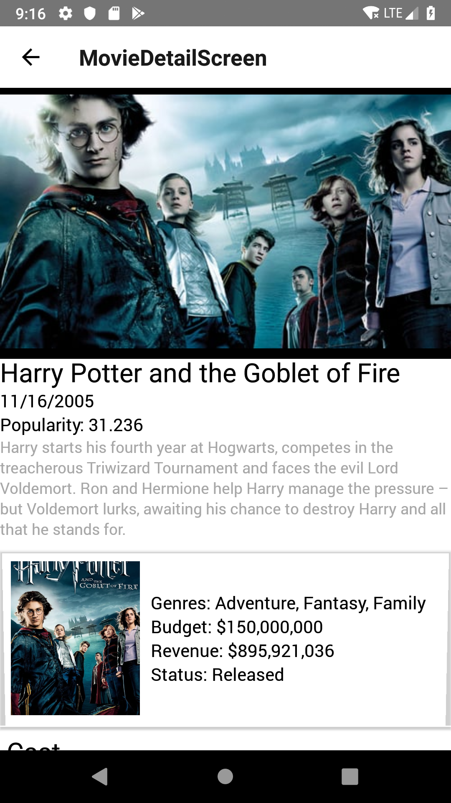
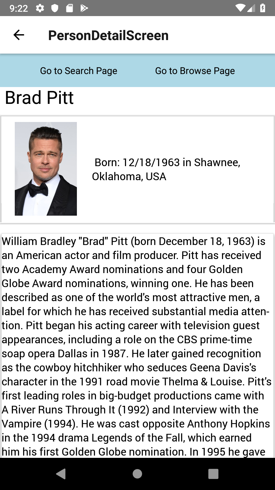
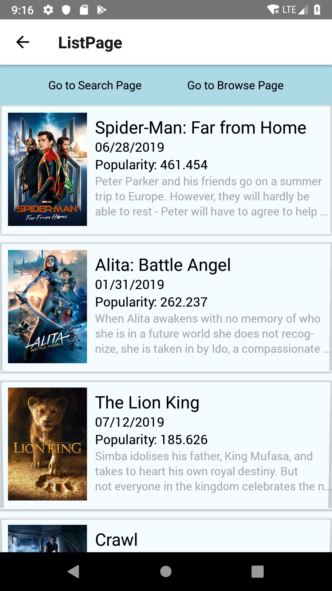

### This is my clone of the IMDB app, written in react native it works with both android and ios devices.

This uses the TMDB API to get results. Each API call only loads 50 movies/actors information. So when a user is scrolling through, at the end of 50 a new API call is issued. Because of this there is never loading times in retrieving information.

### Homescreen of app

### Search Page

### Movie Result page

### And Actor Result page

### From there we can click on a movie and actor and view the details about that.

### And the same for actors

### Oh and you can browse the newest and most popular movies on the browse screen

